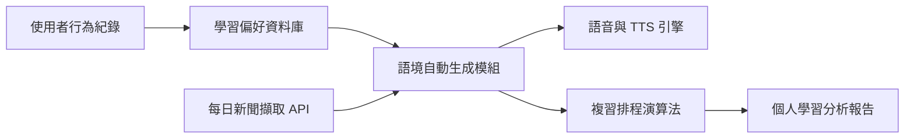

# 團隊介紹

- **團隊名稱**：悄悄偷走兩萬元
- **成員**：組員姓名、組員姓名、組員姓名、組員姓名

---

# 導師諮詢的預先提問

## 設計思考、提案企劃

- 我們的使用者旅程是否合理？
- 有哪些環節可以進一步簡化體驗流程？

## Microsoft Azure

- 如何有效利用 Azure Functions 或 Logic Apps 來串接每日新聞與單字？
- 有哪些免費資源可以協助部署原型？

## AI 賦能

- 語音辨識與語音回饋功能推薦用哪種 AI 模型？
- 如何優化單字推薦與複習排程演算法？

---

# 主題說明

當今學測英文考題越來越重視單字的語境理解與應用，但學生常面臨背誦無效、記憶短暫的困擾。我們設計一個「語境生成式單字學習平台」，結合新聞語料、AI 推薦與語音互動，提升學生對單字的理解與應用，幫助學測生有效記憶單字，應付閱讀測驗與寫作應用。

---

# 執行構想

- 每日自動推送 4 篇短新聞，每篇融合待學習單字
- 依照使用者興趣（科技、娛樂、體育等）推薦主題
- 結合語音朗讀與例句講解，提升語感與用法理解
- 引入 AI 發音與語法評估系統，提高實用能力
- 遊戲化機制：獎勵制度、排行榜、成就勳章等
- 根據遺忘曲線設計複習排程，自動安排舊字重現

---

# 架構規劃與 Azure 資源

---
layout: 4-items
---

# Persona：子傑（17 歲高三生，台中）

::top-left::
## 🎯 **學測生**
重視學習效率

::top-right::
## 📱 **擅用手機**
進行碎片式學習

::bottom-left::
## ❌ **記憶困難**
背過即忘、缺乏用法

::bottom-right::
## 🔍 **期望工具能：**
- 幫助用法理解
- 避免遺忘
- 增加成就感與信心

---
layout: 6-items
---

# Empathy Map

::top-left::
## **想法與感受（Think & Feel）**

- 擔心考不上大學，背了單字卻看不懂文章

::top-center::
## **所聞（Hear）**

- 老師推薦補充教材
- 同學推薦 App
- 社群充斥考試心得與資源

::bottom-left::
## **所見（See）**

- 家長督促學習
- 網路推薦「最好背單字 App」

::bottom-center::
## **所言與所為（Say & Do）**

- 抱怨記不住
- 用 Quizlet、筆記、滑手機學單字

::top-right::
## **痛點（Pain）**

- 背單字無聊、忘記太快、無法持續

::bottom-right::
## **需求（Gain）**

- 有趣有效的記憶方法、長效學習成效

---

# User Journey Map

| 階段     | 行為         | 痛點       | 機會點                              |
| -------- | ------------ | ---------- | ----------------------------------- |
| 發現需求 | 單字記不起來 | 背了又忘   | 導向式 onboarding，標註學測高頻單字 |
| 評估工具 | 比較 App     | 工具太多   | 強調 AI 推薦與遊戲化                |
| 開始使用 | 滑手機時打開 | 容易分心   | 推播提醒與時段推送                  |
| 使用中   | 讀新聞學單字 | 主題不合   | 興趣主題選擇 + 難度調整             |
| 複習強化 | 複習舊單字   | 忘用法     | 融入舊字於新新聞中                  |
| 考試前   | 模擬測驗     | 難掌握弱點 | 錯字清單、AI 模擬試題與圖表分析     |

---

# Storyboard

### 🚌 放學的公車上

> 「明明才背過 recommend，現在又忘了…」

### 🤯 記不起來的焦慮

> 回想老師強調單字重要，卻怎麼樣都記不住

### 💡 發現 App

> 社群推薦語境生成式單字學習 App，產出專屬新聞與句子

### 📰 實際體驗

> 看到「老師 recommend 我們…」，搭配朗讀與例句解說

### 📝 考試得分

> 模擬考中成功寫出 recommend 的用法與句子

### 🎉 分享與成就

> 限動發文：「終於有一個我會繼續用的背單字 App！」

---

# 設計邏輯與技術整合

- 使用者行為驅動內容推薦
- Azure 資源串接新聞與語音服務
- GPT 協助語境生成、錯誤辨識
- 語音互動提供即時練習與回饋
- 遊戲化設計提升學習動力

---
